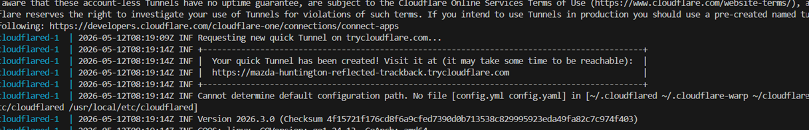

# Aplicación de Login con Docker y HTTPS

Una aplicación web sencilla con registro, inicio de sesión y cierre de sesión. La aplicación usa Flask y PostgreSQL, y se despliega con Docker Compose.

## Características

- Registro de usuario.
- Inicio de sesión con validación de contraseña.
- Cierre de sesión.
- Usuarios almacenados en PostgreSQL.
- Servidor HTTPS con certificado autofirmado.
- Arquitectura con contenedor web y contenedor de base de datos.

## Estructura del proyecto

- `docker-compose.yml` - Define los servicios `web` y `db`.
- `app/Dockerfile` - Construye la aplicación Flask.
- `app/app.py` - Código de la aplicación.
- `app/templates/` - Plantillas HTML.
- `app/static/style.css` - Estilos de la aplicación.
- `app/entrypoint.sh` - Genera el certificado SSL y arranca la app.

## Requisitos

- Docker
- Docker Compose

## Cómo ejecutar

1. Clona el repositorio: 
```bash
git clone https://github.com/JavierMT17/Aplicacion-web-con-Docker.git
```
2. Abre una terminal en el directorio clonado.
3. Ejecuta:

```bash
docker-compose up -d --build
```

Para ver la URL publica generada:

```bash
docker-compose logs -f cloudflared
```

Busca una linea con una URL parecida a:

```text
https://nombre-aleatorio.trycloudflare.com
```


> Esa URL cambiara cada vez que el contenedor del tunel se recree. Para un dominio fijo propio hace falta crear un tunnel permanente en Cloudflare y usar un token.

4. Acceder a la web, para ello copia la URL https que te haya establecido CloudFlare en el recuadro de la imagen anterior y pegala en su navegador.
## Uso

1. Registra un nuevo usuario desde la pantalla de registro.
2. Ve al formulario de login y accede con el usuario registrado.
3. Si ingresas contraseña incorrecta, se mostrará un error y podrás intentarlo de nuevo.
4. Una vez dentro, haz clic en "Cerrar sesión" para volver al login.

## Notas

- La base de datos PostgreSQL se monta en un volumen llamado `db_data`.
- La aplicación crea tablas automáticamente cuando arranca.
- El servidor web se expone con HTTPS en el puerto `8443`.
- El `docker-compose.yml` incluye un servicio `cloudflare` que crea un tunel temporal de Cloudflare. No necesitas cuenta de Cloudflare ni configurar DNS para esta modalidad; Cloudflare genera una URL aleatoria `https://*.trycloudflare.com`.


